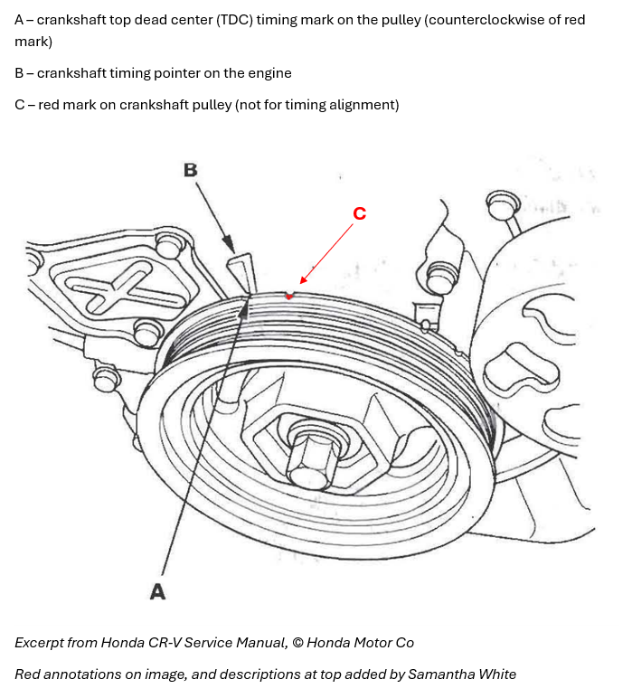

# Timing Procedure 

## Timing alignment between intake and exhaust cam shafts

The no.1 piston must be set at top dead center (TDC). The punch marks on the VTC actuator and the exhaust camshaft sprocket must be at the top. Check the TDC marks on the VTC actuator and exhaust camshaft sprocket. These should be lined up right across from each other.

_Note: rotate the crankshaft 180 degrees if the marks are opposite of each other_ 

> The correct alignment is closer to a **peak-to-valley** line up for the gear teeth than it is to a peak-to-peak line up of the teeth
> Some DIYers mistakenly assume both marks should land on matching gear tooth peaks, but this is not the case.  
> Trust the etched marks on the VTC actuator and the exhaust camshaft sprocket, and line them up straight.

This youtube video shows how to check the timing on the cam shafts: https://youtu.be/wyCcW2w9RQY

## Timing the crankshaft

